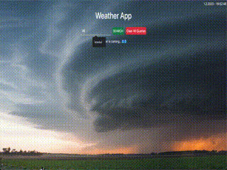

# Weather-App

## Description
Project aims to display current weather data of searched city around the world with fetching Weather Api data.

## Project Skeleton

```
Weather App(folder)
|
|---readme.md 
├── assets
│     ├── snapshot.gif
│     └── image.gif
├── style.css
├── app.js
└── index.html
```



## Objects

User story;

  - User can search any city around the world and display weather data of searched city in weather card.
  - The app can fetch api with the searched city name.
  - If new searched city is in the weather data list, app can display a warning text to user on page.


<p align="center"> <strong> ✍ Happy Coding ⌛ </strong> <p>
